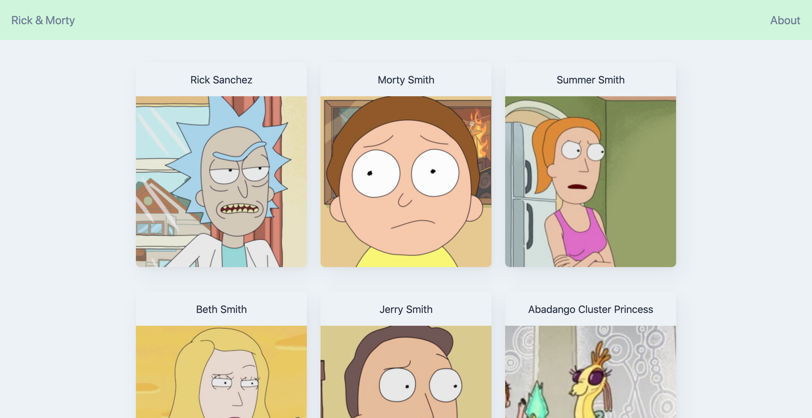
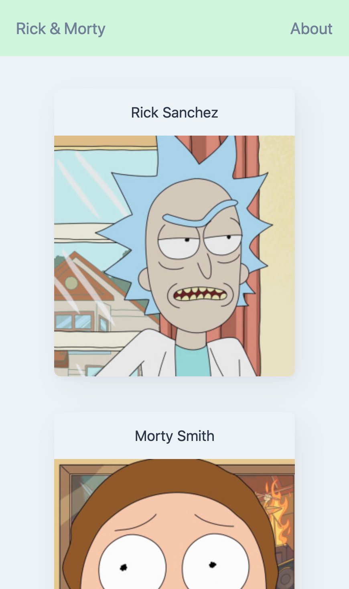
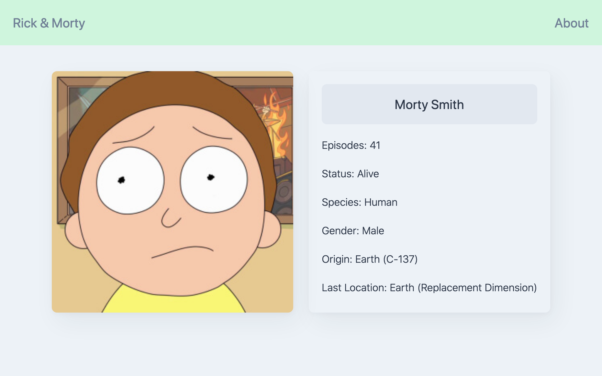

# Rick & Morty SPA


## ✍🏻 Description
This app was built in SPA course in Platzi. In addition to what was seen in the course, I implemented all the CSS with Tailwind. It was a challenge for me to implement this framework in webpack. It was satisfying to get this result.

You can see the result here → [Rick & Morty - Characters](http://alejandra-camacho.me/Rick-Morty/)

## 🚀 Getting Started
The application is built with webpack. You can run the following command to install all dependencies.
```
$ npm install
```

## 🎨 Preview
<details>
    <summary>🖥 Desktop version</summary>



</details>

<details>
    <summary>📱 Mobile version</summary>
    


</details>

<details>
    <summary>✉️ Cards</summary>
    


</details>

<br>

## 👩🏻‍💻 Technologies
1. HTML
2. CSS
3. PostCSS
4. Tailwind CSS
5. Javascript
6. Webpack